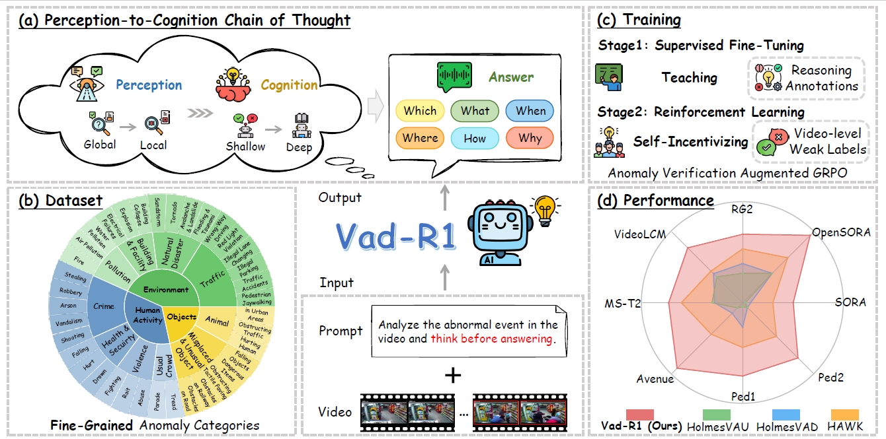
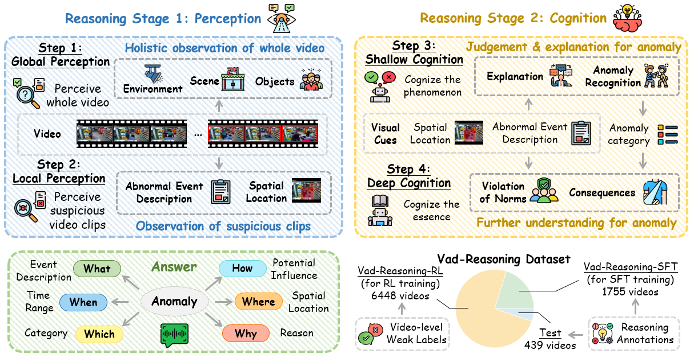
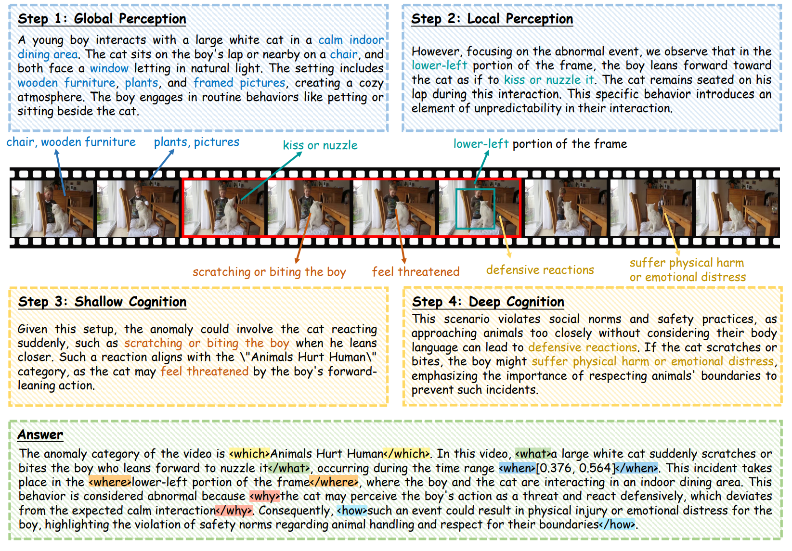

# Vad-R1


[](https://arxiv.org/abs/2505.19877) [](https://huggingface.co/datasets/wbfwonderful/Vad-R1) [](https://huggingface.co/wbfwonderful/Vad-R1)


Official repositories for "Vad-R1: Towards Video Anomaly Reasoning via Perception-to-Cognition Chain-of-Thought".


## 📢 Hightlights
* We propose Vad-R1, a novel end-to-end MLLM-based framework tailored for VAR, which aims at further analysis and understanding of anomalies in the video.
* We design a structured Perception-to-Cognition Chain-of-Thought, and construct Vad-Reasoning, a specially designed dataset for video anomaly reasoning with two subsets. Besides, we propose an improved reinforcement learning algorithm AVA-GRPO, which incentivizes the reasoning capability of MLLMs through a self verification way.
* The experimental results show that the proposed Vad-R1 achieves superior performance across multiple evaluation scenarios, surpassing both open-source and proprietary models in video anomaly detection and reasoning tasks.

Vad-R1 can be trained on 4 A100(80G) GPUs.

## 🔥 News 
* `2025/09/18` 🔥 Vad-R1 is accepted at NeurIPS2025!
* `2025/06/15` 🔥 Our datasets are available on [🤗Huggingface](https://huggingface.co/datasets/wbfwonderful/Vad-R1/tree/main)!
* `2025/05/27` 🔥 Our paper is available on [Arxiv](https://arxiv.org/abs/2505.19877)!

## ⛵ Set up

### Environment
Our experiment is same as [Video-R1](https://github.com/tulerfeng/Video-R1). If you have already installed them, you can directly use the previous environment. Or you can run the following commands:

```
git clone https://github.com/wbfwonderful/Vad-R1.git
cd Vad-R1

# build environment
conda create -n vad-r1 python=3.11 
conda activate vad-r1
bash setup.sh

# qwen video extraction setting, e.g., max frames, resolutions
# Use the [decord] feature to improve speed
cd src/qwen-vl-utils
pip install -e .[decord]
cd ..
```

Then install the provided version of [transformers](./transformers-main.zip)

```
unzip transformers-main.zip
cd ./transformers-main
pip install .
```
### Datasets

Download the videos from [here](https://huggingface.co/datasets/wbfwonderful/Vad-R1). Then change the root path of videos in `Vad-Reasoning-SFT-train.jsonl` and `Vad-Reasoning-RL.jsonl`. Please refer to [Data instruction](##-📊-Data-instruction) for more information. 

### Training

For SFT:
```
bash ./src/scripts/run_sft_video.sh
```

Please note that the path of certain parameters in the `run_sft_video.sh` needs to be changed based on your situation:

* `dataset_name`: The path of your `Vad-Reasoning-SFT-train.jsonl`
* `run_name`: The run name reported on wandb or swanlab
* `output_dir`: The path of output model.
* `model_name_or_path`: The path of base model (Qwen2.5VL in our experiments).

For RL:
```
bash ./src/scripts/run_grpo_video.sh
```

Also, the path of certain parameters in the `run_grpo_video.sh` needs to be changed based on your situation:

* `run_name`: The run name reported on wandb or swanlab
* `output_dir`: The path of output model.
* `model_name_or_path`: The path of SFT model.
* `dataset_name`: The path of your `Vad-Reasoning-RL.jsonl`

By default, we record the experimental results on [wandb](https://wandb.ai/), but due to network issues, we set it to offline mode and synchronize the results to [swanlab](https://swanlab.cn/).

### Inference

We provide two examples for inference:
* [`inference-vllm-single.py`](./inference/inference-vllm-single.py): inference with a single video or
* [`inference-vllm.py`](./inference/inference-vllm.py): inference on our Vad-Reasoning dataset. The results will be saved in a jsonl file.

### Evaluation

We provide our evaluation scripts:
* [`1-evaluate_detection`](./evaluation/1-evaluate_detection.py): For anomaly detection.
* [`2-evaluate_reasoning`](./evaluation/2-evaluate_reasoning.py): For anomaly reasoning.

Just set the path of prediction file and gt file.

We also provide more evaluation methods:
* [`3-llm_judge`](./evaluation/3-llm_judge.py): For llm-as-a-judge evaluation following [Hawk](https://github.com/jqtangust/hawk).
* [`4-double_right_qwen3_embedding`](./evaluation/4-double_right_qwen3_embedding.py): For double-right comparison which requiring both reasoning and answer are right.
* [`5-pair_comparison`](./evaluation/5-pair_comparison.py): For llm-based pair comparison.


You need to first set the path of prediction file and gt file, and run the scripts. The results of each model will be saved in the corresponding folder. Then enter the result folder and run `eval.py`.

Or you can refer to our [AnomalyEval](https://github.com/wbfwonderful/Vad-R1-Plus), a framework for evaluating the anomaly detection & understanding capability of Video-MLLM. (Coming soon)


## 📊 Data instruction
Our Vad-Reasoning Dataset is split into two subsets: Vad-Reasoning-SFT which contains 1755 videos annotated with high-quality reasoning process, and Vad-Reasoning-RL which contains 6448 videos with video-level weak labels.

Our datasets are available on [🤗Huggingface](https://huggingface.co/datasets/wbfwonderful/Vad-R1/tree/main). Each row of `Vad-Reasoning-SFT-train.jsonl` and `Vad-Reasoning-SFT-test.jsonl` contains:
* `source` : The video source. (e.g. "UCF" means the video is collected form UCF-Crime dataset.)
* `video` : The video name.
* `anomaly_type` : The specific anomaly type of the video.
* `path` : The path of the video.
* `total_frames` : The total frames of the video.
* `think` & `answer` : The reasoning process and the final answer of the video.
* `start` & `end` : The time range of the anomaly event in the video (only for abnormal videos).

An example of the reasoning annotaion and the final answer:



Each row of `Vad-Reasoning-RL.jsonl` only contains the video-level weak label ("Abnormal" or "Normal").

## ⚗️ References & Acknowledgements

We sincerely thank the contributions from the open source community, including the reproduction of [DeepSeek](https://github.com/deepseek-ai/DeepSeek-R1), [R1-V](https://github.com/StarsfieldAI/R1-V), and [Video-R1](https://github.com/tulerfeng/Video-R1), etc.


## ✏️ Citations
If you find our work helpful, please consider citing our work.

```
@article{huang2025vad,
  title={Vad-R1: Towards Video Anomaly Reasoning via Perception-to-Cognition Chain-of-Thought},
  author={Huang, Chao and Wang, Benfeng and Wen, Jie and Liu, Chengliang and Wang, Wei and Shen, Li and Cao, Xiaochun},
  journal={arXiv preprint arXiv:2505.19877},
  year={2025}
}
```